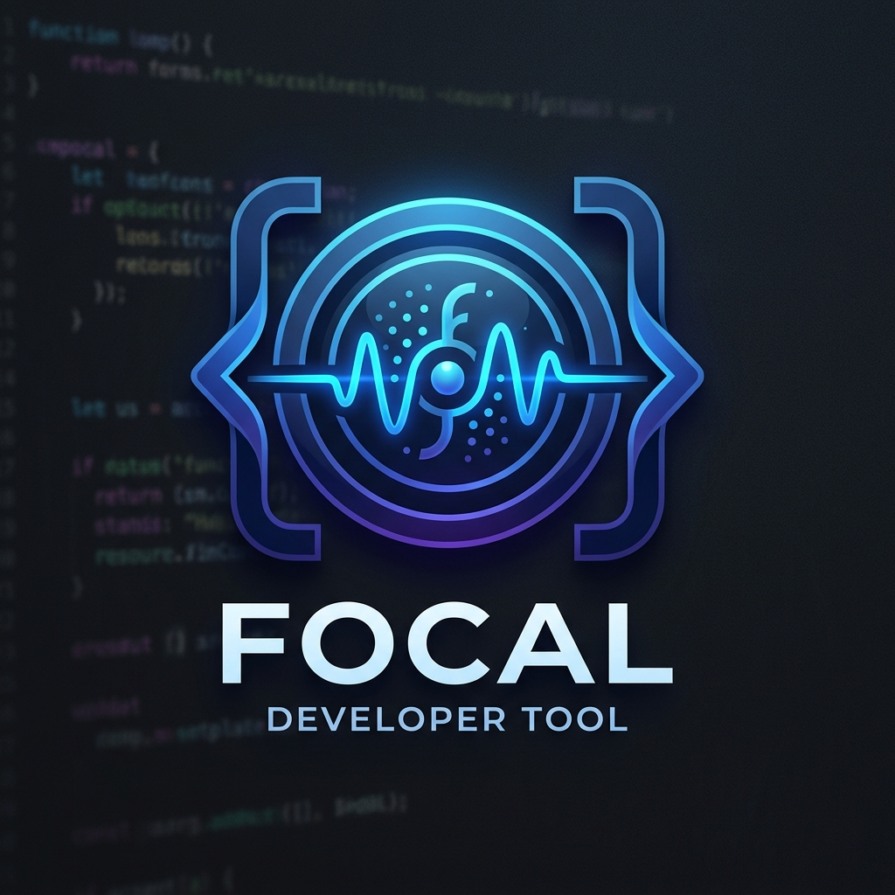
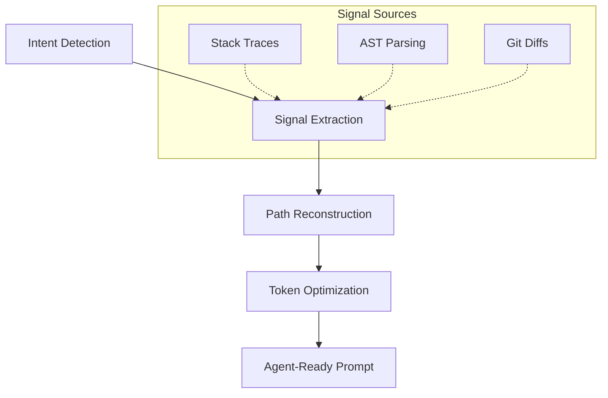

<p align="center">
  
</p>

<h1 align="center">⚡ Focal</h1>

<p align="center">
  <strong>Give your coding agent only the code it actually needs.</strong>
</p>

<p align="center">
  <a href="https://www.npmjs.com/package/@focal/core"></a>
  <a href="https://github.com/sahil28123/Focal/blob/main/LICENSE"></a>
  
  
</p>

---

## 🚨 The Problem

LLM coding agents are often overwhelmed by too much information. When you send entire files or irrelevant context, you get:

- ❌ **Wrong Fixes**: The agent gets lost in the noise.
- ❌ **Hallucinations**: Irrelevant code confuses the model.
- ❌ **Token Waste**: Paying for context that doesn't help.
- ❌ **Latency**: Larger prompts take longer to process.

## ⚡ The Fix: Focal

Focal turns your repository into **high-signal context**. It extracts only the essential parts of your code, optimizing for both accuracy and token efficiency.

- ✅ **Function-level Precision**: No more sending 600-line files for a 5-line fix.
- ✅ **Runtime-Aware**: Links context directly to stack traces and test failures.
- ✅ **Execution Paths**: Reconstructs the actual flow of logic.
- ✅ **Adaptive Focus**: Automatically predicts what else might break.

---

## 🧠 How it Works

Focal uses a precision-first approach to context extraction:



### Signal vs. Noise Comparison

| Feature | Standard Context (RAG/Full-File) | Focal Context |
| :--- | :--- | :--- |
| **Granularity** | File-level | **Function/Block-level** |
| **Relevance** | Lexical similarity | **Execution-path aware** |
| **Token Usage** | High (1000s of tokens) | **Minimal (50-200 tokens)** |
| **Accuracy** | Hit-or-miss | **High Signal** |

---

## 🔥 Example

### Before (What most tools send)
```typescript
// auth.ts (600 lines)
// middleware.ts (400 lines)
// utils.ts (300 lines)

👉 1300+ lines (Mostly noise)
```

### After (Focal)
```typescript
// auth.ts
function validateToken(...) { ... }   // 📍 error site (30 tokens)

// middleware.ts
function authMiddleware(...) { ... }  // 🔗 caller (40 tokens)

// Execution Path:
// server.ts → auth.ts::validateToken ❌
```
👉 **~80 tokens total** | **Maximum Signal**

---

## ⚡ Quick Start

### For Developers (CLI)
Install globally to use Focal from your terminal:
```bash
npm install -g @focal/cli
focal build --query "Fix token validation crash" --stack-trace ./error.log
```

### For Builders (Library)
Integrate Focal into your own coding agent:
```bash
npm install @focal/core
```

```typescript
import { Focal, FocalFormatter } from '@focal/core';

const context = await Focal.build({
  repoPath: './repo',
  query: 'Fix token validation crash',
});

const prompt = new FocalFormatter().toPrompt(context, {
  style: 'xml-tags'
});
```

---

## 🚀 Why Focal is Different

1.  **Runtime-Aware Context**: Focal doesn't just guess. It follows the error by analyzing `--stack-trace`, `--test-output`, and `--diff`.
2.  **Function-Level Precision**: Using `tree-sitter` for AST parsing, Focal extracts the exact function needed, not the whole file.
3.  **Execution Path Modeling**: LLMs understand flows better than flat files. Focal provides the logical sequence of calls.
4.  **Breakage Prediction**: Automatically identifies "what else might break" by following local dependencies.
5.  **100% Local-First**: No vector databases, no complex infra, no setup. Just run it.

---

## 🧪 Real Impact
- 🔻 **60–80%** fewer tokens.
- ⚡ **Faster** agent responses.
- 🎯 **Pinpoint** accurate fixes.

---

## 🔥 Mental Model

Focal is not a search tool or a database. 

> [!IMPORTANT]
> **Focal is a compiler for LLM context.** 
> It transforms raw source code into the highly-optimized intermediate representation that LLMs actually need to solve problems.

---

<p align="center">
  Built with ❤️ for the next generation of AI-native developers.
</p>